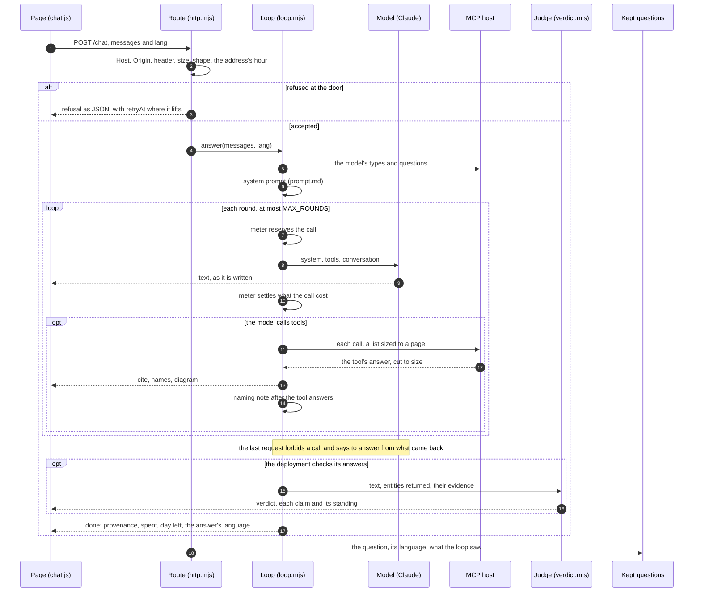

# Answering

A message is answered by a model that may only ask the MCP host's tools, so every claim in the answer comes from what a tool returned, and the page links each entity the answer read to where it is mastered. Everything that can refuse a message does so before the model is asked, so a refusal costs nothing.

## The steps

**At the door** (`lib/http.mjs`). A POST is refused, in this order, for a Host the deployment did not name, an Origin it did not name, a missing `X-Chat` header, a body over the cap, a body that is not the shape, and an address over its hour. A refusal before the stream is JSON with a code, and a limit that lifts by itself names the moment in `retryAt`. The caps are in `lib/shape.mjs`, and the codes in the [interface](../INTERFACE.md).

**Before the first call** (`lib/loop.mjs`, `answer()`). The shape is checked again and the conversation cut to its window (`lib/shape.mjs`). The host's types and questions are read, cached per commit (`lib/host.mjs`), and the system prompt is built as [The prompt](prompt.md) shows. Every call reserves its estimate from the meter and settles at once against what it cost (`lib/meter.mjs`), so a spent day or month refuses the next call and never one already made.

**A round.** The model is sent the system prompt, the host's tools and the conversation, and its text goes to the page as it comes. Each tool it calls goes to the host, a list with a page that arrives whole (`pageSized()` in `lib/shape.mjs`), and the answer is cut to the size `truncate()` allows before the model reads it. One entity answered is a `cite`, every entity a list named is a `names` event, and a picture the host drew is a `diagram` event the page draws while the model reads only a note of it. After the tool answers the model reads the naming note (`nameNote()` in `lib/prompt.mjs`), the last thing before it writes.

**The last request** forbids a tool call and says to answer from what the tools returned (`FINAL_NOTE` in `lib/model.mjs`). A silence is asked once more as the last request; an answer the output limit cut is not a silence, and `done` says `cut`.

**After the text.** Where the deployment checks its answers, the judge reads each claim against the tool answers that carried the entities it names (`lib/verdict.mjs`), within its own budget, and sends `verdict` before `done`; a check that could not run sends nothing. `done` names the commit the answer was read at, what the message cost, what is left of the day, and the language the answer is written in, read from its words.

**What is kept.** Once the visitor has the answer or the refusal, one line goes to the log: the question as sent, its language, and what the loop saw, the entities cited, the calls, the empty ones and the rounds (`keep()` in `lib/http.mjs`). No address and no word of the answer.
